# Separate hyperplane with Linear programing
This assignment was made as a term project for the class of Optimal Nonlinear Design for the 2021-1 semester. The goal of this task is to separate the dummy of points using a hyperplane. There are two types of datasets in this task. One can split two dummy with a linear-hperplane and the other can split two dummy with a non-linear-hyperplane.
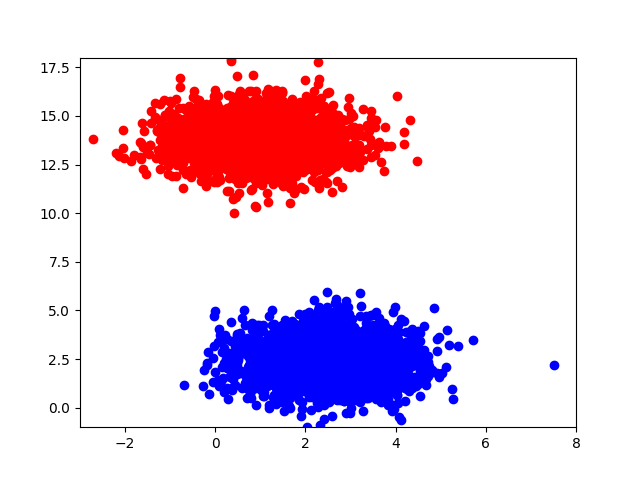
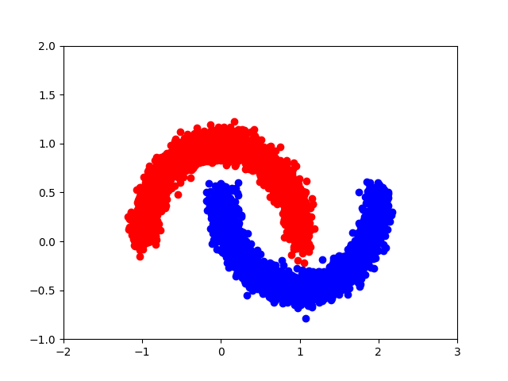

The example of dummies(datasetA-5000, datasetB-5000)


## Installation
Before anything else, you must have the cplex-env virtual environment installed. Everything proceeds under the assumption that the cplex-env virtual environment is installed.

```
# You must be on the enviroment of `cplex`
pip setup.py install
pip install -e .
```

## Results
### DataSetA-1000.dat
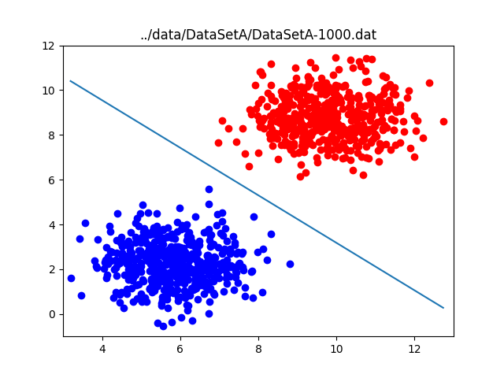
### DataSetB-1000.dat
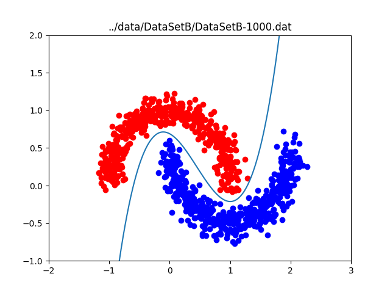
### DataSetA-2000.dat
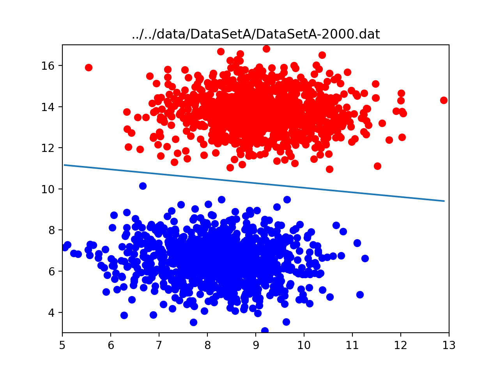
### DataSetB-2000.dat
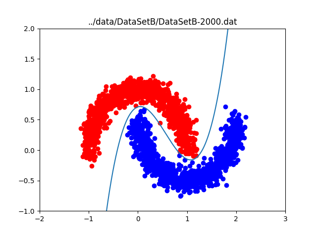
### DataSetA-3000.dat
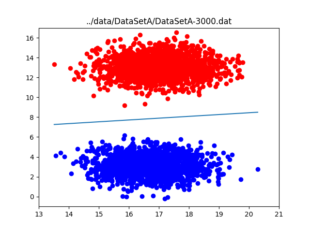
### DataSetB-3000.dat
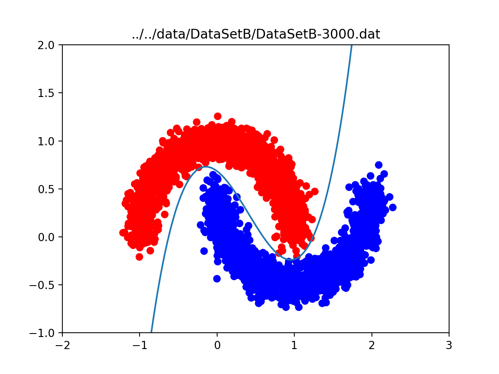
### DataSetA-4000.dat
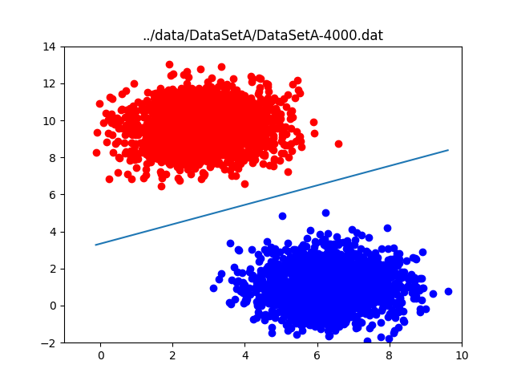
### DataSetB-4000.dat
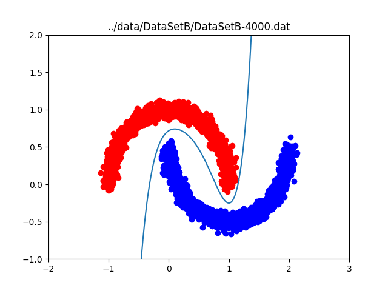
### DataSetA-5000.dat
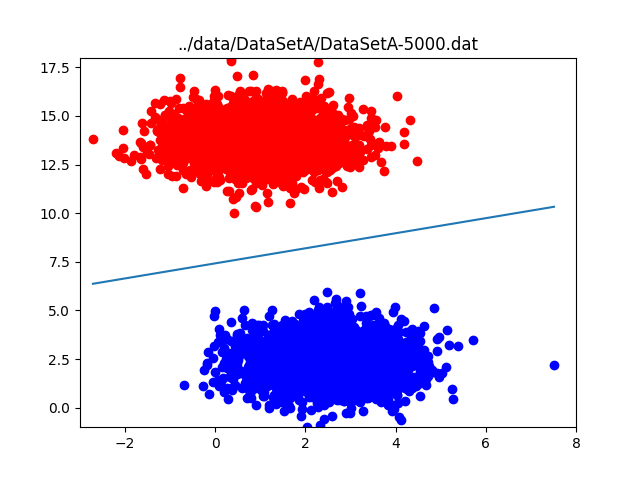
### DataSetB-5000.dat


## Example
To check the generalized code, I tried to obtain the hyperplane separation by changing only the order using an arbitrary dumy.
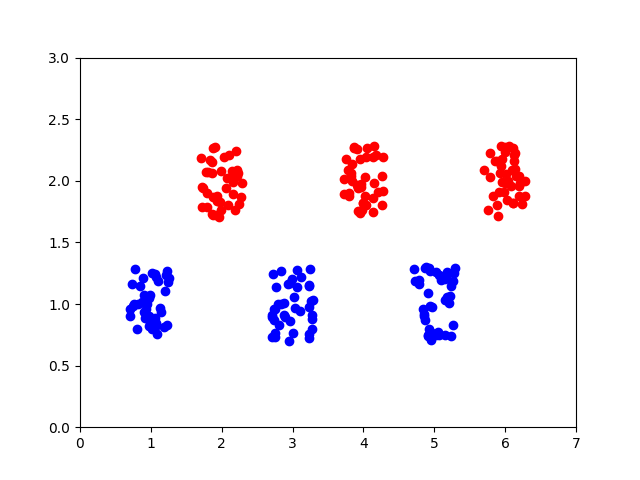
### Order 1
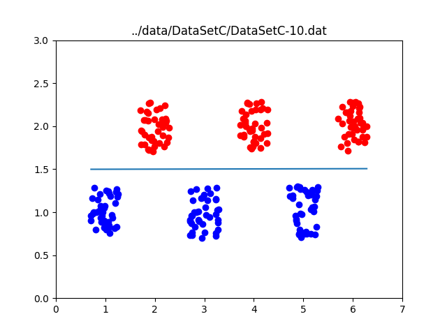
### Order 2
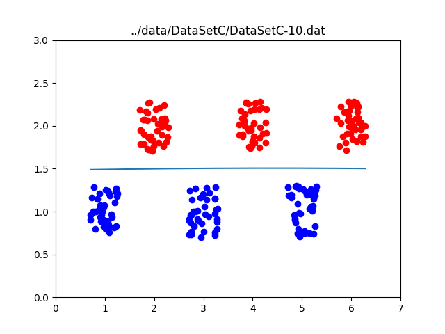
### Order 5
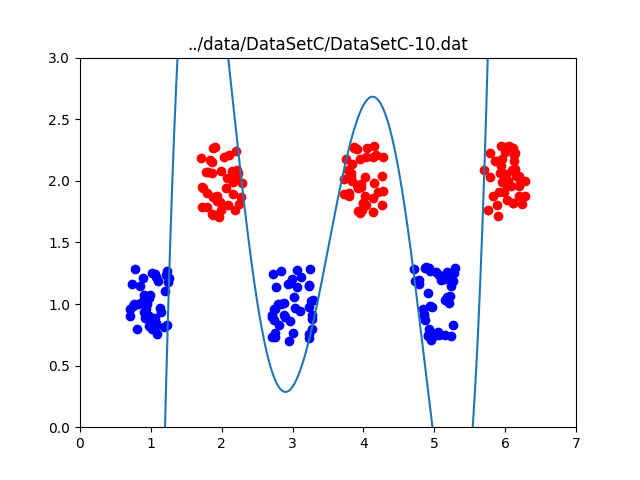